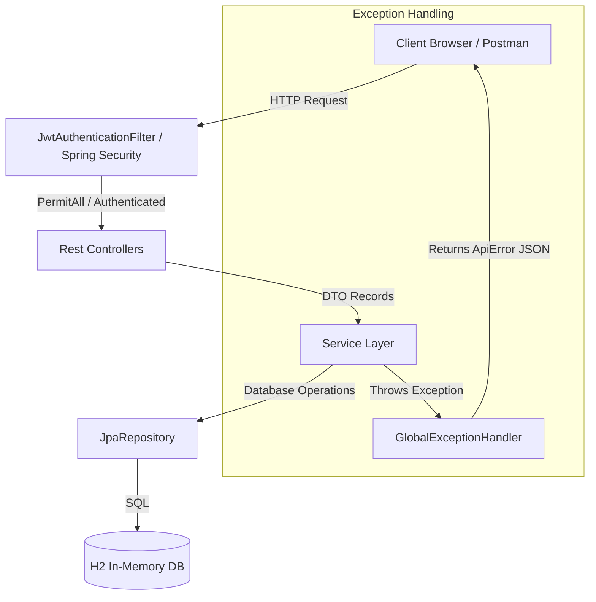

# 🌟 Spring Boot E-Commerce REST API

A modern, secure, and production-grade Spring Boot REST API demonstrating a complete e-commerce backend solution. Built with standard engineering design patterns, robust security practices, and comprehensive unit/integration test coverage.

---

## 🚀 Key Features & Architectural Patterns

- **Layered Architecture**: Strictly follows the **Controller-Service-Repository** pattern to ensure clean separation of concerns and maintainability.
- **DTO Pattern for Security**: Uses Java Records as Data Transfer Objects (DTOs) for incoming requests and outgoing responses. This guarantees that internal entity schemas and sensitive data (e.g., BCrypt-hashed passwords) are **never leaked** in API responses.
- **Security Hardening**:
  - Stateless **JWT (JSON Web Token) Authentication** utilizing HMAC-SHA256 signature algorithms.
  - Custom `JwtAuthenticationFilter` integrating with standard Spring Security filter chains.
  - Secure configuration using **Spring Security 6.x** Lambda DSL specifications.
  - Secret key rotation & configurations externalized to `application.yml`.
- **Transactional Consistency**: Handles order placement under Spring's `@Transactional` boundaries, ensuring atomic inventory stock deductions and rollback on stock deficit.
- **Unified Global Exception Handling**: Out-of-box error management using `@RestControllerAdvice` mapping validation constraints (`@Valid`, `@NotBlank`, `@Size`, `@Email`) and custom exceptions (`ResourceNotFoundException`, `BusinessException`) to a structured, serialized JSON error response (`ApiError`).
- **Code Standards**: Fully formatted using the Google/Palantir standards via `spotless-maven-plugin`.

---

## 🛠️ Technology Stack

* **Java & Spring Boot**: Java 17+, Spring Boot 3.5.x, Spring Data JPA, Spring Security.
* **Database**: In-Memory H2 Database (with H2 Console enabled at `/h2-console`).
* **Authentication**: JJWT (Java JWT Library), BCrypt Cryptography.
* **Testing**: JUnit 5, Mockito, MockMvc (Integration Testing).
* **Build Tool**: Apache Maven.

---

## 🗂️ System Design & Flow



---

## 📌 REST API Endpoint Specifications

### Authentication API (`/api/auth`)

| Endpoint | Method | Security | Request Body DTO | Response | Description |
| :--- | :---: | :---: | :--- | :--- | :--- |
| `/api/auth/register` | `POST` | PermitAll | `RegisterRequest` | `UserResponse` | Register a new user client. Password is automatically hashed. |
| `/api/auth/login` | `POST` | PermitAll | `LoginRequest` | `AuthResponse` | Validate credentials and return a stateless JWT Bearer Token. |

### Products API (`/api/products`)

| Endpoint | Method | Security | Request Body DTO | Response | Description |
| :--- | :---: | :---: | :--- | :--- | :--- |
| `/api/products` | `POST` | **ADMIN** | `ProductRequest` | `ProductResponse` | Create a new active inventory product. |
| `/api/products` | `GET` | PermitAll | None | `List<ProductResponse>` | List all active inventory products. |

### Orders API (`/api/orders`)

| Endpoint | Method | Security | Request Body DTO | Response | Description |
| :--- | :---: | :---: | :--- | :--- | :--- |
| `/api/orders` | `POST` | **Authenticated** | `OrderRequest` | `OrderResponse` | Place a transaction order. Deducts items from product stocks. |

---

## ⚙️ Setup & Installation

### Prerequisites
- JDK 17 or higher
- Maven 3.6+

### Steps
1. **Clone the repository**:
   ```bash
   git clone https://github.com/ssiddhesh64/springboot-ecommerce-api.git
   cd springboot-ecommerce-api
   ```
2. **Build the application**:
   ```bash
   mvn clean install
   ```
3. **Run the Spring Boot application**:
   ```bash
   mvn spring-boot:run
   ```
4. **Access the endpoints**:
   - The server runs on port `8081` by default.
   - Access Swagger or H2 Console at `http://localhost:8081/h2-console` (JDBC URL: `jdbc:h2:mem:testdb`, Username: `sa`, Password: `password`).

---

## 🧪 Running the Test Suite

This project includes robust testing strategies covering mock assertions, entity behavior, and servlet endpoint integration.

To execute the test suite (Unit and MockMvc Integration tests):
```bash
mvn clean test
```

### Apply Code Formatting & Style Checks
To format the codebase and enforce styling conventions:
```bash
mvn spotless:apply
```
